# School_District_Analysis

# Overview
* The purpose of this analysis was to create an overview of the school district that would focus on "math & reading test grades", "students grade levels", "dollar spending per school" and "student populations size" to help with future planning and budget allocations.

## Results
### Data Cleaning & Refactoring
* Before the analysis could begin, the data provided needed to be cleaned.
    * Some Students had pre fixes in their  names that needed to be removed. (Such as Ex. "Dr.")
    
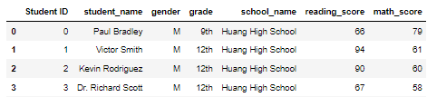

* Data cleaned using following method:

```
# Add each prefix and suffix to remove to a list.
prefixes_suffixes = ["Dr.", "Mr.", "Ms.", "Mrs.", "Miss", "MD", "DDS", "DVM", "Phd" ]

# Iterate through the words in the "prefixes_suffixes" list and replace them with an empty space, "".
for word in prefixes_suffixes:
    student_data_df["student_name"] = student_data_df["student_name"].str.replace(word,"")
```

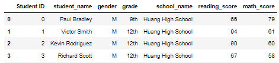

* Additionally,  Thomas High School was providing incomplete data specifically with their 9th graders and was removed to provide accurate results.
    * Without cleaning this data, Thomas High School was displaying much lower performance.
* Before data was cleaned:

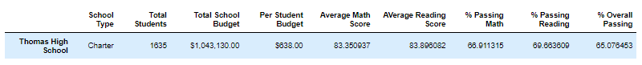

* The corrupted 9th graders data was cleaned using the following method:

```
# Get the number of 10th-12th graders from Thomas High School (THS).
ths_tenth_graders = school_data_complete_df[(school_data_complete_df["grade"] == "10th")
                                        & (school_data_complete_df["school_name"]=="Thomas High School")].count()['Student ID']
ths_eleventh_graders = school_data_complete_df.loc[(school_data_complete_df["grade"]== "11th")
                                        & (school_data_complete_df["school_name"]=="Thomas High School")].count()['Student ID']
ths_twelvth_graders = school_data_complete_df.loc[(school_data_complete_df["grade"]== "12th")
                                        & (school_data_complete_df["school_name"]=="Thomas High School")].count()['Student ID']

ths_total_students = ths_tenth_graders + ths_eleventh_graders + ths_twelvth_graders

ths_total_students
print(ths_total_students)
1174

# Get all the students passing math from THS
ths_passing_math = school_data_complete_df.loc[(school_data_complete_df["school_name"]=="Thomas High School") 
                                           & (school_data_complete_df["math_score"] >= 70)].count()["Student ID"]
print(ths_passing_math)
1094

# Get all the students passing reading from THS
ths_passing_reading = school_data_complete_df.loc[(school_data_complete_df["school_name"]=="Thomas High School") 
                                           & (school_data_complete_df["reading_score"] >= 70)].count()["Student ID"]
print(ths_passing_reading)
1139

# Get all the students passing math and reading from THS
ths_passing_reading_math = school_data_complete_df.loc[(school_data_complete_df["school_name"]=="Thomas High School") 
                                           & (school_data_complete_df["reading_score"] >= 70)
                                           & (school_data_complete_df["math_score"] >= 70)].count()["Student ID"] 
print(ths_passing_reading_math)
1064

# Calculate the percentage of 10th-12th grade students passing math from Thomas High School. 
per_ths_math =  ths_passing_math / ths_total_students * 100
print(per_ths_math)
93.18568994889267

# Calculate the percentage of 10th-12th grade students passing reading from Thomas High School.
per_ths_reading =  ths_passing_reading / ths_total_students * 100
print(per_ths_reading)
97.01873935264055

# Calculate the overall passing percentage of 10th-12th grade from Thomas High School. 
per_ths_reading_math = ths_passing_reading_math / ths_total_students * 100
print(per_ths_reading_math)
90.63032367972743

# Replace the passing math percent for Thomas High School in the per_school_summary_df.
per_school_summary_df.loc[["Thomas High School"],['% Passing Math']]= per_ths_math 

# Replace the passing reading percentage for Thomas High School in the per_school_summary_df.
per_school_summary_df.loc[["Thomas High School"],['% Passing Reading']]= per_ths_reading

# Replace the overall passing percentage for Thomas High School in the per_school_summary_df.
per_school_summary_df.loc[["Thomas High School"],['% Overall Passing']]= per_ths_reading_math
```

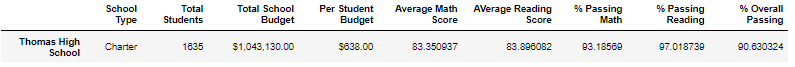

* Data cleaning Results:
    * The District summary was impacted with regards to the total number of students being measured to have my accurate representation on what the analysis was focusing on.
    * The School summary was affected by having the correct total number of students that were being measured to have accurate results.
    * Thomas High School was postively impacted with their overall results increasing.
          * Math and reading scores by grade increased.
          * Scores by school spending were more accurate result of a smaller student population.
          * Scores by school size allowed for schools to be properly classified because of an accurate student population.
          * Score by school type was affected by the scores itself being more accurate resulting in accurate results for types.


### Results Overview

* District Summary

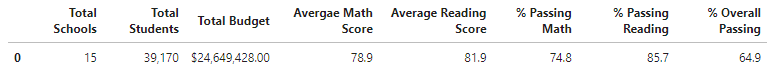

* School Summary

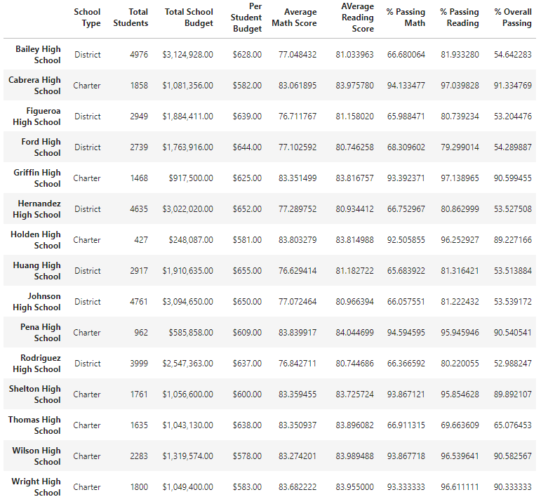

* Spending Grade Average

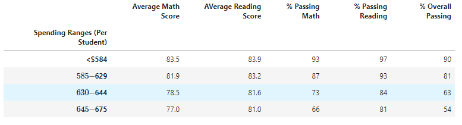

* Scores by School Size

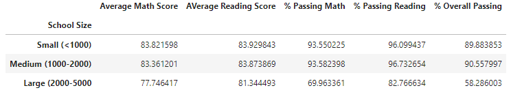

* Scores by School Type

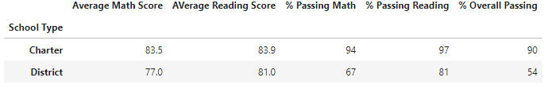

* Top Five Schools

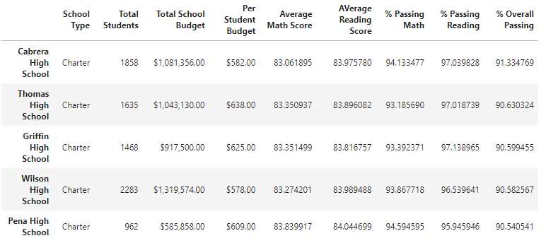

* Bottom Five Schools

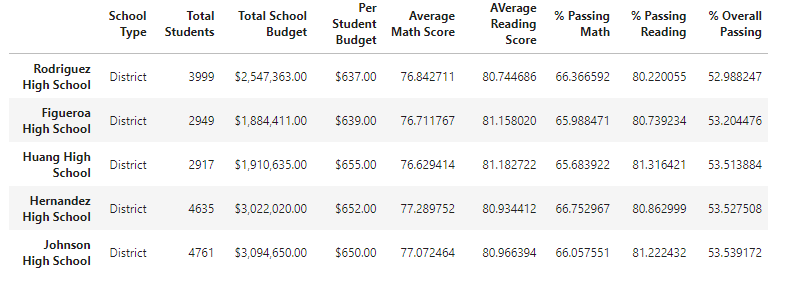

## Summary
* Changes made to name prefixes were removed to have accurate student names.
* 9th graders from Thomas High School were negatively impacting the analysis and were removed.
    * This had an impact on total student size and increased the % grade for the high school.
* Additionally, the use of '.loc' was added which helped narrow the focus on Thomas High School to determine the correct results.  

